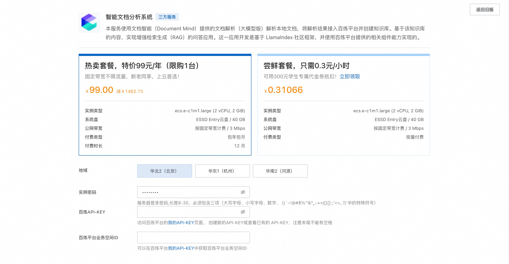
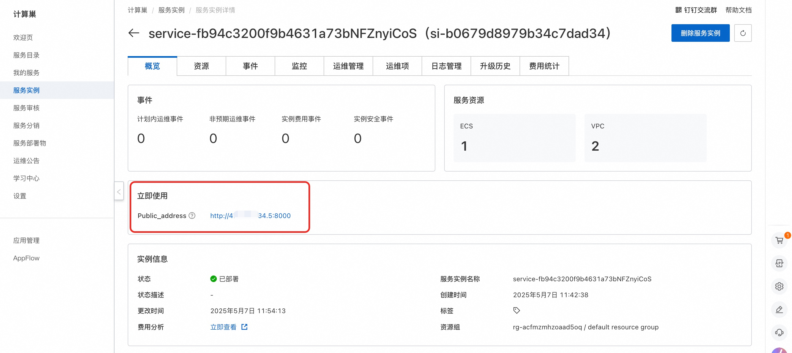
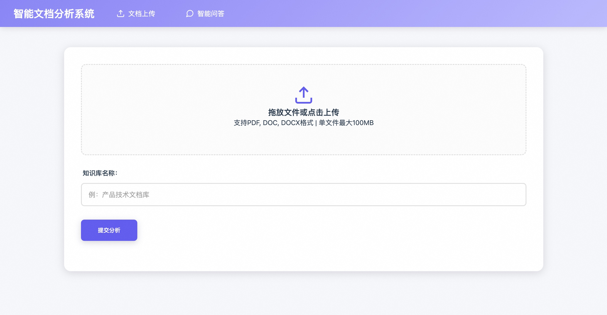

## 简介
大语言模型（LLM）作为自然语言处理的核心技术能力，能在文档中为知识问答、内容生成、大数据清洗、办公流程自动化等场景挖掘出更多的价值，极大降低了普通人对于专业词汇多、结构复杂、图文混合的文档内容阅读门槛。但文档的处理十分具有挑战性，特别是在 PDF 格式下，多种合同、试卷、论文、财报、简历、报告场景中，对于输入给大模型所需要的就不仅仅是文本内容，同时包括表格内容、公式文本、图片内容处理，以及无关内容的过滤。

对于不同格式的文档输入，如何实现将文档智能和检索增强生成（RAG）结合起来构建强大的 LLM 知识库，关键是如何清洗文档内容，将文档内容向量化，并最终在问答内容召回后，通过特定的 Prompt，提供给 LLM足够的上下文信息，以此来满足对企业级文档类型知识库的问答处理。 本服务将基于文档智能的文档解析处理，结合百炼平台构建单文档问答应用。

## 计费说明
本服务在阿里云上的费用主要涉及：
* 所选GPU云服务器的规格
* 磁盘容量
* 公网带宽

计费方式：按量付费（小时）或包年包月
预估费用在创建实例时可实时看到。

百炼模型调用费用:
* 当您首次开通百炼时，平台会自动为您发放各模型的新人专属免费额度，详情请看[百炼新人免费额度](https://help.aliyun.com/zh/model-studio/new-free-quota?spm=a2c4g.11186623.help-menu-2400256.d_4_1.6dea55efFQCijR#view-quota)。

## RAM账号所需权限

| 权限策略名称                          | 备注                     |
|---------------------------------|------------------------|
| AliyunECSFullAccess             | 管理云服务器服务（ECS）的权限       |
| AliyunVPCFullAccess             | 管理专有网络（VPC）的权限         |
| AliyunROSFullAccess             | 管理资源编排服务（ROS）的权限       |
| AliyunComputeNestUserFullAccess | 管理计算巢服务（ComputeNest）的用户侧权限 |

## 部署服务

1. 单击[部署链接](https://computenest.console.aliyun.com/service/simple/deploy?ServiceId=service-fb94c3200f9b4631a73b)，进入服务实例部署界面，根据界面提示，填写参数。
    

2. 确认订单完成后点击**立即创建**。
3. 等待部署完成后进入服务实例详情。
    

4. 点击公网访问地址使用服务。
    
